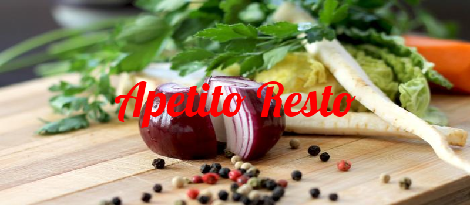
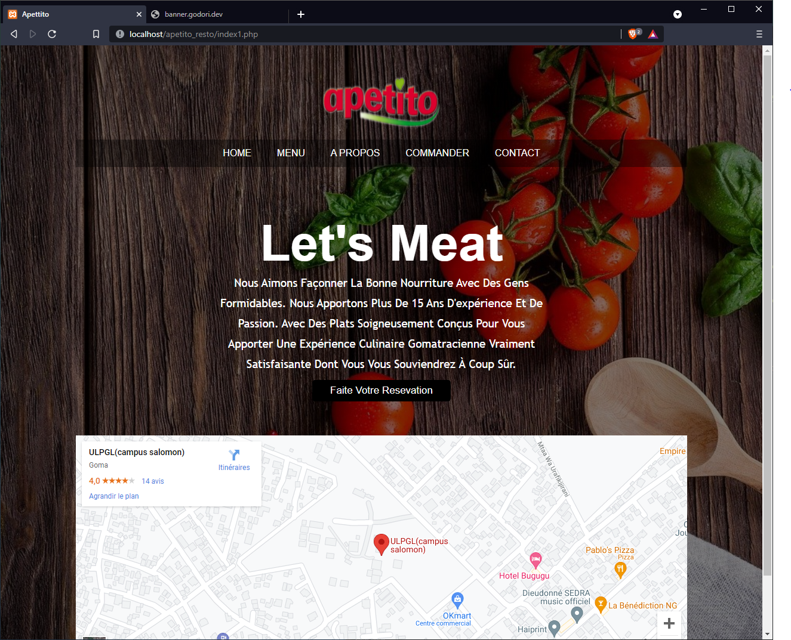

<!-- Headings -->
# Project Description

    This program is a web app for a restaurant the program offers 3 principal functionalities:  the login, logout and ordering system.

## Technologies used 

In this project i use the following technologies:
* php : For the backend.
* SQL : For the data base. 
* HTML and CSS : For structure ans style.

## Project screenshorts

<!-- Images -->

## Short Youtube Video 
If you wanna know how the app work you can [View the presantation of the project here](#)